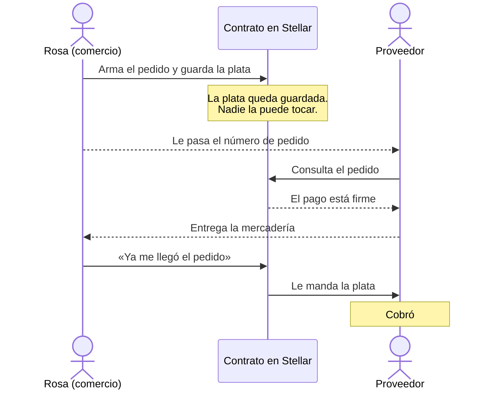

# 🤝 Minga — que el pago no dependa de la confianza

🌐 [English](README.md) · **Español**

> ### *Muchas manos levantan lo que una sola no puede.*

Minga es una aplicación para que un comercio chico pueda comprarle mercadería a un
proveedor sin que ninguno de los dos tenga que arriesgar primero.

La plata queda **guardada y bloqueada** hasta que la mercadería llega. Ahí se libera
sola. Si el pedido no llega, vuelve a quien la puso.

Por debajo funciona con un contrato en la red **Stellar**, pero la persona que usa la
app nunca toca eso. Solo lee *"Pedido creado"* y *"Pago liberado"*.

---

## Por qué existe

Yo tenía una panadería y la terminé cerrando.

No escribo código. Construyo Minga con herramientas de inteligencia artificial,
preguntando y probando, porque no quiero esperar a que alguien con más estudios
decida que este problema vale la pena.

Lo que me mueve no es una idea de negocio. Es que conozco de primera mano lo que es
poner toda tu plata en un comercio chico. Cada decisión de este proyecto está tomada
pensando en esa persona: la que no tiene un banco atrás, la que no tiene un abogado,
la que si pierde un pedido pierde la semana.

Por eso el proyecto tiene dos reglas que no se negocian:

1. **Que se entienda.** Todo, desde la app hasta este archivo, escrito en lenguaje
   claro. Si hace falta saber qué es una blockchain para usarlo, está mal hecho.
2. **Que entre cualquiera.** Diseño universal: la aplicación tiene que servir sin
   importar cómo ve, oye, se mueve o lee cada persona.

---

## El problema, con nombre y apellido

Rosa tiene un almacén de barrio. Cuando necesita mercadería choca siempre con lo mismo:

- Si **paga por adelantado**, se arriesga a que el pedido no llegue o llegue mal.
- Si **paga después**, muchos proveedores no le creen y no le venden.

Alguno de los dos tiene que arriesgar primero. Y como ninguno quiere, la compra
muchas veces no se hace.

Las empresas grandes resuelven esto hace años: tienen bancos, contratos y abogados
que garantizan el pago entre dos que no se conocen. Un almacén de barrio no tiene
nada de eso.

**Minga le da esa misma herramienta a Rosa.**

---

## Cómo funciona

A lo que queda guardado en el medio se le dice **escrow**, que es un depósito en
garantía: la plata está, pero nadie la puede tocar todavía.

1. **Rosa arma el pedido** y elige cuántos días se da para revisar la mercadería
   cuando llegue (de 1 a 60; normalmente 3). Firma, y la plata sale de su billetera
   y queda bloqueada en el contrato. **Ni Rosa ni el proveedor la tienen.**
2. **El proveedor consulta el número de pedido** y ve que el pago está garantizado.
   Entrega tranquilo.
3. **Rosa confirma que recibió** y el contrato le manda la plata al proveedor.
4. **Si el pedido no se concreta**, Rosa cancela y recupera todo.

El recorrido de cuando todo sale bien, paso a paso:



### Y si algo sale mal

Esta parte es la que más trabajo costó, porque es donde se juega si el proveedor
también puede confiar.

La primera versión tenía un agujero: confirmar dependía solo de Rosa. Si el proveedor
entregaba y Rosa no confirmaba nunca —por olvido, porque perdió el teléfono, o de
mala fe— la plata quedaba trabada para siempre y el proveedor no tenía salida.

Ahora **el proveedor puede avisar "ya entregué"** con su propia firma. Eso arranca el
reloj del plazo que Rosa eligió:

- Si Rosa **confirma**, cobra el proveedor.
- Si Rosa **no dice nada** y el plazo se vence, el proveedor cobra igual. El silencio
  ya no lo perjudica.
- Si Rosa **objeta** dentro del plazo ("esto no me llegó, o me llegó mal"), la plata
  se **frena**. No cobra nadie hasta que una de las dos partes ceda: o Rosa libera el
  pago, o el proveedor devuelve la plata.

Los caminos posibles, completos:

```mermaid
stateDiagram-v2
    accTitle: Los caminos posibles de un pedido
    accDescr: Un pedido empieza pendiente. Desde ahí Rosa puede confirmar y el proveedor cobra, o cancelar y recupera la plata. Si el proveedor avisa que entregó, el pedido pasa a entregado y arranca el plazo de Rosa. Desde entregado, el proveedor cobra si Rosa confirma o si se vence el plazo; se cancela si el proveedor se echa atrás; y queda en disputa si Rosa objeta dentro del plazo. En disputa la plata está frenada hasta que Rosa libera el pago o el proveedor devuelve la plata.
    state "Pendiente<br/>plata guardada en el contrato" as Pendiente
    state "Entregado<br/>arranca el plazo de Rosa" as Entregado
    state "En disputa<br/>plata frenada, no cobra nadie" as Disputa
    state "Liberado<br/>cobra el proveedor" as Liberado
    state "Cancelado<br/>la plata vuelve a Rosa" as Cancelado

    [*] --> Pendiente: Rosa crea el pedido y elige el plazo
    Pendiente --> Liberado: Rosa confirma
    Pendiente --> Cancelado: Rosa cancela
    Pendiente --> Entregado: el proveedor firma «ya entregué»
    Entregado --> Liberado: Rosa confirma
    Entregado --> Liberado: se vence el plazo y el proveedor reclama
    Entregado --> Cancelado: el proveedor se echa atrás
    Entregado --> Disputa: Rosa objeta dentro del plazo
    Disputa --> Liberado: Rosa cede y libera
    Disputa --> Cancelado: el proveedor cede y devuelve
    Liberado --> [*]
    Cancelado --> [*]
```



**Lo que este prototipo todavía no resuelve:** una disputa en la que ninguna de las
dos partes cede. Eso necesita un árbitro, y está fuera de alcance por ahora. Lo
decimos acá y no en una nota al pie, porque esconderlo sería vender algo que no es.

---

## Una falla que encontramos y cerramos

Vale la pena contarla, porque es el tipo de cosa que decide si este producto sirve o
es peligroso.

**El problema.** El contrato es público: cualquiera puede llamarlo sin pasar por la
app. Antes, al crear un pedido se le indicaba con qué moneda se iba a pagar. Alguien
podía crear un pedido con una **moneda falsa** —una que dice "transferí" pero no vale
nada—. El proveedor consultaba, veía "pago bloqueado y garantizado", entregaba la
mercadería de verdad y cobraba algo que no valía nada.

Eso rompía exactamente la promesa de Minga.

**El arreglo.** Ahora la moneda se fija **una sola vez**, en el momento de instalar el
contrato en la red, y no hay ninguna función que la cambie. No queda ningún lugar
donde meter una moneda falsa. Cualquiera puede preguntarle al contrato qué moneda
acepta (`get_token`) antes de confiar en él.

La revisión completa está en [`docs/revision-seguridad.md`](docs/revision-seguridad.md).
**No es una auditoría** y no la presentamos como tal: una auditoría la hace gente de
afuera que cobra por romperte el código. Esto es una revisión interna, hecha contra la
lista oficial de vulnerabilidades que publica Stellar.

---

## En qué estado está hoy

| | Qué hay |
|---|---|
| **El contrato en la red (testnet)** | La versión nueva, instalada el **22/09/2026**: [`CDUJYPSQ…WLMAZ73G`](https://stellar.expert/explorer/testnet/contract/CDUJYPSQOFAQOHNQLERLEG54USCED3MJIGNHLWTILAKUZ22PWLMAZ73G) |
| **La app en vivo** | [minga-r5ql.vercel.app](https://minga-r5ql.vercel.app) |
| **Los tests** | **29 pruebas automáticas, todas en verde** |

El contrato que está en la red es el mismo que está en el código: plazo, entrega
declarada por el proveedor, disputa, avisos en la red y la moneda fijada en el deploy.

La evidencia, con el enlace a cada transacción y la comprobación de que la moneda quedó
bien fijada, está en [`DESPLIEGUE-TESTNET.md`](DESPLIEGUE-TESTNET.md). También queda ahí
el despliegue de julio, que muestra el flujo completo ejecutado on-chain con plata
moviéndose de verdad entre billeteras.

---

## Qué se construyó esta semana

Septiembre 2026, durante el **Argentina Builder Challenge**:

- **Se cerró la falla de la moneda falsa** (la que está contada más arriba).
- **Plazo y disputa**, para que el proveedor no quede rehén del silencio de Rosa.
- **Avisos públicos en la red.** Cada cambio de estado deja un aviso que cualquiera
  puede leer. Sirve para dos cosas: que la app pueda mostrar el historial de pedidos
  leyendo la red en vez de depender de la memoria del celular, y que tanto Rosa como
  el proveedor puedan demostrar lo que hicieron sin depender de la palabra del otro.
- **Que los pedidos no se archiven.** En Stellar los datos guardados vencen. Ahora cada
  pedido renueva su fecha mientras se use, para que a nadie le "desaparezca" un pedido.
- **La app al día con el contrato nuevo**: billetera en la pantalla del proveedor,
  campo de plazo, botón para frenar el pago, cuenta regresiva, y consulta a la red cada
  minuto.
- **Accesibilidad**: los avisos de pago se anuncian en voz alta para lectores de
  pantalla, foco visible al navegar con teclado, contraste corregido, letra más grande
  y teclado numérico en el celular.
- **Revisión de seguridad** completa del contrato, escrita.
- **Pruebas de propiedades**: además de probar casos uno por uno, la computadora inventa
  miles de combinaciones al azar y verifica que las cuentas siempre cierren. Las
  comprobamos rompiendo el contrato a propósito, para asegurarnos de que avisan.
- **Prototipo navegable** de las tres pantallas del comerciante, en
  [`mockups/minga-app.html`](mockups/minga-app.html): se abre con doble clic, sin
  instalar nada.
- **Decisión de moneda: USDC.** Buscando cómo haría Rosa para sacar la plata,
  apareció MoneyGram Ramps: permite retirar efectivo en mostrador **sin cuenta
  bancaria**, en más de 170 países, y funciona con USDC sobre Stellar. Para alguien
  excluido del sistema financiero, eso no es un detalle técnico: es la diferencia
  entre que la plata le sirva o no.

---

## Diseño universal: por qué la app está hecha así

La accesibilidad no es un agregado del final. Está en
[`docs/diseno-accesible.md`](docs/diseno-accesible.md), y se apoya en tres marcos:

- **Las 10 heurísticas de usabilidad de Jakob Nielsen**, para que se entienda.
- **La Convención sobre los Derechos de las Personas con Discapacidad** (artículos 2, 9
  y 21) y el diseño universal, para que se entienda sin importar cómo ve, oye, se mueve
  o lee cada persona.
- **WCAG 2.1 nivel AA** como referencia técnica concreta.

Algunas decisiones que salen de ahí:

- **El color nunca informa solo.** Cada estado lleva ícono, palabra y trama propia, así
  también se entiende en blanco y negro o con daltonismo.
- **Los mensajes dicen qué pasó y qué hacer**, no un código de error.
- **Ninguna palabra del mundo cripto aparece en la pantalla.** No se lee "escrow", ni
  "wallet", ni "transacción".

---

## Cómo está hecho

```
minga/
├── contracts/escrow/        # El contrato (Rust, Soroban)
│   ├── src/lib.rs           #   la lógica: crear, entregar, confirmar, objetar, cobrar
│   ├── src/test.rs          #   las pruebas del flujo completo
│   └── src/propiedades.rs   #   las pruebas al azar
├── frontend/                # La app (React + TypeScript)
│   ├── src/wallet.ts        #   conexión con la billetera (Stellar Wallets Kit)
│   ├── src/stellar.ts       #   la capa que habla con la red
│   ├── src/escrow.ts        #   las funciones del contrato, tipadas
│   └── src/screens/         #   pantallas Comerciante y Proveedor
├── mockups/minga-app.html   # Prototipo navegable, se abre con doble clic
├── marca/                   # El logo, en varios tamaños y formatos
├── docs/                    # Revisión de seguridad, diseño accesible, integraciones
├── entrevistas/             # Guías de entrevista por rubro + consentimiento
└── COMANDOS.md              # Los comandos exactos, para copiar y pegar
```

### Lo que hace el contrato

**Funciones que mueven plata** (hay que firmar con la billetera):

| Función | Quién firma | Cuándo se puede |
|---|---|---|
| `create_escrow(comprador, proveedor, monto, id_pedido, plazo_dias)` | el comerciante | siempre |
| `marcar_entregado(id_pedido)` | **el proveedor** | solo si está Pendiente |
| `confirm_delivery(id_pedido)` | el comerciante | Pendiente, Entregado o En disputa |
| `cancel_escrow(id_pedido)` | el comerciante | **solo si está Pendiente** |
| `objetar_entrega(id_pedido)` | el comerciante | solo Entregado y **dentro** del plazo |
| `reclamar_pago(id_pedido)` | **el proveedor** | solo Entregado y **vencido** el plazo |
| `devolver_fondos(id_pedido)` | **el proveedor** | Entregado o En disputa |

**Funciones que solo miran** (gratis, sin firma): `get_escrow_status`, `get_escrow`,
`get_token`, `segundos_restantes`, `puede_reclamar`.

La moneda se fija al instalar el contrato (`__constructor`) y no se puede cambiar nunca.

### Dónde toca la red de verdad

Buscá los comentarios `*** ON-CHAIN ***` en
[`contracts/escrow/src/lib.rs`](contracts/escrow/src/lib.rs): ahí es donde la plata se
mueve de verdad entre la billetera del comerciante, el contrato y el proveedor.

En [`frontend/src/stellar.ts`](frontend/src/stellar.ts), el comentario
`*** ESTO ES ON-CHAIN REAL ***` marca el punto exacto donde la operación se firma y se
manda a la red.

Para conectar la billetera usamos **Stellar Wallets Kit**, que soporta varias
(Freighter, xBull, Albedo, LOBSTR) con una sola conexión. Elegimos eso para no atar a
nadie a una billetera sola.

---

## Probarlo

**Lo más rápido, sin instalar nada:** abrí
[`mockups/minga-app.html`](mockups/minga-app.html) con doble clic, o entrá a
[minga-r5ql.vercel.app](https://minga-r5ql.vercel.app) y consultá el pedido **42** en
la pestaña *Proveedor* (esa es la versión de julio, la que está en la red).

**Correr las pruebas** (lo que verifica que el contrato hace lo que dice):

```bash
cd contracts/escrow
cargo test        # tienen que pasar 29
```

**Levantar la app:**

```bash
cd frontend
npm install
npm run dev       # abre http://localhost:5173
```

Los comandos completos para instalar el contrato en la red están en
[`COMANDOS.md`](COMANDOS.md).

Todo corre en **Stellar Testnet**, la red de prueba: **no se usa plata real.**

---

## Hoja de ruta

Acá está **todo lo que Minga promete y todavía no hace**. Está separado de lo que ya
funciona a propósito: nada de esto está construido, y no queremos que se lea como si
lo estuviera.

El orden no es un capricho. Cada etapa necesita que la anterior exista.

### Ahora mismo

| | Qué |
|---|---|
| ✅ | ~~Instalar el contrato nuevo en la red.~~ Hecho el 22/09/2026. |
| 🔜 | **Dejar pedidos de demostración** en el contrato nuevo, para que cualquiera pueda consultarlos sin instalar nada. |
| 🔜 | **El historial de pedidos leído desde la red**, usando los avisos que el contrato ya publica. |

### Etapa 1 — Que cargar no cueste nada

**Cargá sin escribir.** El comerciante le saca una foto a la boleta del proveedor, o
lo dice en voz alta. La app muestra lo que entendió y **la persona confirma o
corrige** — nunca decide sola.

Funciona con boletas informales: un papel escrito a mano que dice *"azúcar 10 kg"*,
sin dirección ni teléfono, sirve igual. Es lo que la mayoría de los proveedores
chicos entrega de verdad.

**Control de stock y avisos.** Con lo que se carga, la app sabe qué se está
terminando y avisa antes de que falte.

**Pedir por WhatsApp.** Un enlace que abre el WhatsApp del proveedor con el pedido ya
escrito. El comerciante solo toca "enviar". No hace falta que el proveedor tenga
Minga, ni que sepa que existe.

### Etapa 2 — La Feria: la biblioteca de precios

Cada boleta cargada deja registrado **qué producto, a qué precio, de qué proveedor y
en qué fecha**. Con eso se arma un registro de precios en común, anónimo, que todos
los comercios pueden consultar.

Rosa tiene su almacén. Marianita tiene una despensa a cinco cuadras. Bernardo vende
maderas. Los tres alimentan el mismo registro y los tres lo usan.

Cuatro decisiones de fondo:

**1. El cruce es por producto, no por rubro.**

A Bernardo no le sirve saber cuánto sale el azúcar. Pero la **cinta de embalaje**,
las **bolsas** y el **papel** los compran él y Rosa por igual. Los insumos genéricos
cruzan rubros que no tienen nada que ver entre sí.

Si el registro fuera por rubro, cada almacenera necesitaría otras almaceneras cerca
para que le sirviera de algo. Cruzando por producto, **un maderero y una almacenera
ya se ayudan entre ellos** sin vender nada parecido. Algunos productos coinciden,
otros no — y eso está bien: cada comercio ve lo que le toca.

**2. El precio siempre va con su fecha.**

En Argentina los precios se mueven todas las semanas. Un precio de referencia de hace
seis meses no sirve para nada. Saber qué está pagando Marianita **esta semana** es la
diferencia entre remarcar a tiempo o vender por debajo del costo sin darse cuenta.

**3. No depende de que los proveedores adopten nada.**

Un proveedor informal no se va a bajar una aplicación. Pero el comerciante ya recibe
su papel, y lo carga porque le sirve a él: para saber cuánto paga y para que no se le
termine la mercadería. **La biblioteca se arma de rebote**, como efecto de algo que ya
le conviene hacer.

Lo mismo con el orden administrativo: no hace falta llevar un Excel ni aprender un
sistema de gestión. Se saca la foto, y de ahí sale lo que compró, cuánto gastó y qué
le está faltando. **El orden es efecto secundario de algo que tarda tres segundos.**

**4. Dónde se guarda cada cosa.**

| Qué | Dónde | Por qué |
|---|---|---|
| **La biblioteca de precios** | En Minga, compartida entre todos los comercios | Tiene que ser rápida y barata de consultar. Guardar miles de precios en la blockchain costaría carísimo y sería lento. |
| **El historial de pagos** | En la red Stellar | Es lo que después se convierte en reputación y en crédito. Eso sí tiene que ser imborrable y no depender de que Minga siga existiendo. |

Es una decisión a propósito, no una comodidad: cada dato va donde corresponde según
para qué sirve.

> **Nota sobre cómo se cuenta esto.** Este archivo lo leen jurados, mentores y
> programadores, así que acá se explica dónde vive cada cosa. **En la aplicación no
> aparece nada de esto.** La comerciante no lee la palabra "blockchain" ni le
> prometemos que se puede "llevar sus datos": a alguien que cierra su negocio eso no
> le sirve de nada. El historial le importa en un solo momento —cuando quiere pedir
> crédito— y para entonces la app se lo muestra, sin explicarle dónde está guardado.

### Etapa 3 — Reputación

Cada pago cumplido deja una constancia pública en la red. Muchos pagos cumplidos son
**un historial verificable** que el comerciante se lleva con él, y que ningún
intermediario le puede quitar ni negar.

Es lo que hoy no tiene: un comercio informal es invisible para el sistema financiero
porque no puede demostrar nada de lo que hizo.

### Etapa 4 — Crédito sin banco

Con historial de pagos y registro de inventario, un comerciante puede pedir crédito
mostrando lo que hizo, no papeles que no tiene. El inventario mismo puede funcionar
como garantía.

Esta es la razón por la que Minga existe. Todo lo anterior construye la base para
esto.

### Decisiones tomadas, pendientes de hacer

- **Pasar a USDC.** Por **MoneyGram Ramps**: permite retirar efectivo en mostrador
  **sin cuenta bancaria**, en más de 170 países. Para alguien excluido del sistema
  financiero, eso es la diferencia entre que la plata le sirva o no.
- **Mediadores para las disputas trabadas.** Hoy, si ninguna de las dos partes cede,
  la plata queda frenada y el contrato no tiene salida. La idea es que un tercero
  pueda destrabarla. Falta definir quién: personas designadas, o un grupo que vote.
  Sea cual sea, la regla de fondo no cambia: **el mediador decide hacia quién va la
  plata, pero nunca puede quedársela.**
- **Piezas auditadas de [OpenZeppelin](https://github.com/OpenZeppelin/stellar-contracts).**
  Dos cosas concretas:
  - **Contratos actualizables** (SEP-0049). Hoy el contrato no se puede corregir: si
    aparece un error hay que instalar uno nuevo, y los pedidos viejos quedan en el
    anterior.
  - **Los detectores de seguridad**, que revisan el contrato buscando fallas típicas.
    No lo modifican, solo lo analizan.

  > **Lo que no vamos a usar, y es a propósito:** el control de permisos y las listas
  > de autorizados. El contrato de Minga **no tiene dueño ni administrador**: nadie,
  > ni quien lo escribió, puede tocar la plata de un pedido. Agregar un rol
  > privilegiado sería crear exactamente lo que el producto promete que no existe. Y
  > una lista de autorizados reproduciría el sistema que deja a esta gente afuera:
  > acá cualquiera puede ser proveedor sin pedirle permiso a nadie.
- **Auditoría de seguridad externa**, por el camino del Stellar Community Fund y el
  Audit Bank. La revisión interna que ya está hecha
  ([`docs/revision-seguridad.md`](docs/revision-seguridad.md)) es preparación para
  eso, no un reemplazo.
- **Evaluar [Trustless Work](https://www.trustlesswork.com/)**, que ofrece escrow
  como servicio sobre Stellar. Podría ahorrar mantener contrato propio. Es una
  decisión para más adelante, con el producto en la calle.

### Cómo se sostiene Minga

**Decidido, para empezar: 1% de comisión por venta cerrada, cobrada al proveedor.**
No a Rosa. Ella es la persona que hoy el sistema excluye — cobrarle a ella repetiría
el mismo problema que Minga resuelve. El que paga es el proveedor, porque es quien
gana algo nuevo: vender con el pago asegurado a comerciantes que antes no le
compraban por no conocerlo.

**Planeado, con la Etapa 4: microcréditos.** Cuando el historial de pagos cumplidos
alcance para ofrecer crédito (ver "Etapa 4 — Crédito sin banco" arriba), esa misma
pieza también financia la plataforma: un margen sobre el crédito otorgado, o una
comisión de originación si el crédito lo da un socio financiero y Minga solo aporta
el historial que lo hace posible. Todavía no está construido — depende de que la
Etapa 3 (reputación) esté funcionando primero.

**En evaluación, no decidido: hacer rendir la plata varada.** Una idea que **solo
vale con condiciones estrictas**, y que sigue siendo secundaria frente a la comisión
y los microcréditos.

La plata que espera dentro del contrato podría generar un rendimiento. Pero acá hay
una línea que no se cruza: **la plata de un pedido en curso no se toca nunca.** Rosa
tiene que poder recuperarla en el momento en que cancela, sin depender de nada ni de
nadie. Esa es la promesa central de Minga y no se negocia por un rendimiento.

Lo único que se podría poner a rendir es **la plata que quedó varada**: pedidos
olvidados, disputas que nadie destrabó hace meses. Y con tres condiciones:

1. **Retiro inmediato garantizado.** Si el dueño aparece, cobra al instante. Si no se
   puede asegurar eso, no se hace.
2. **Un plazo largo y explícito** antes de considerar que algo está varado, avisado
   de antemano.
3. **El rendimiento es de quien puso la plata**, no de Minga, salvo que se acuerde
   otra cosa a la vista.

Si alguna de las tres no se cumple, la idea se cae.

**Esto último no está construido ni decidido.** Está escrito acá para que la
discusión sea pública y no una sorpresa.

**Pendiente de medir: el costo de los anchors y las trustlines.** Dos cosas técnicas
que hoy no están presupuestadas:

- **Trustlines.** Cada cuenta que quiera tener una moneda que no sea el XLM nativo
  (como USDC) necesita abrir una, y eso bloquea **0,5 XLM de reserva** por cuenta
  mientras esté abierta. Es un costo de la red, chico pero real, y crece con cada
  comerciante nuevo.
- **Anchors** (como MoneyGram Ramps, ya mencionado arriba). Convierten entre pesos y
  la moneda de Stellar, y cada uno tiene su propia tabla de comisiones. Normalmente lo
  paga quien retira o deposita, no Minga — pero hay que revisar esa tabla antes de
  elegir uno, y no está hecho todavía.

Entra en la misma idea de fondo: usar las piezas que ya existen en el ecosistema de
Stellar en vez de reinventarlas, y medir bien lo que cuestan antes de depender de
ellas.

### Por qué el escrow fue lo primero

De todas estas etapas, **el escrow es la única que no puede existir sin blockchain**.
Cargar boletas, controlar stock o avisar por WhatsApp se pueden hacer con tecnología
común. Garantizar un pago entre dos personas que no se conocen, sin una empresa en el
medio que se quede con la plata, no.

Por eso se construyó primero: es la pieza donde la red hace falta de verdad, y la que
sostiene a todas las demás.

---

El estado detallado y los pendientes del día a día están en
[`ESTADO-Y-PROXIMOS-PASOS.md`](ESTADO-Y-PROXIMOS-PASOS.md).

---

## Quiénes

**Cintia Venecia** · **Octavio Giménez Bravo** — Salta, Argentina.

Las entrevistas de descubrimiento se hicieron con emprendedoras y emprendedores reales
de Salta, de tres rubros distintos, para validar que el problema de la confianza con
los proveedores existe de verdad y no es una suposición nuestra. Las guías y el
consentimiento están en [`entrevistas/`](entrevistas/).

El proyecto nació en la **Stellar Pulso Hackathon** (julio 2026) y sigue creciendo en
el **Argentina Builder Challenge** (septiembre 2026).

## Enlaces

- Repositorio: https://github.com/veneciaedith/minga
- App en vivo (versión de julio): https://minga-r5ql.vercel.app
- Video demo: https://youtu.be/6X-0l_hIbqs
- El contrato en el explorador: [stellar.expert](https://stellar.expert/explorer/testnet/contract/CCYCSIXOT4XBMEGE2AQUMHZ2JKURZXRKB6MH7DFFQCDCZQGSL3MX2W5N)
