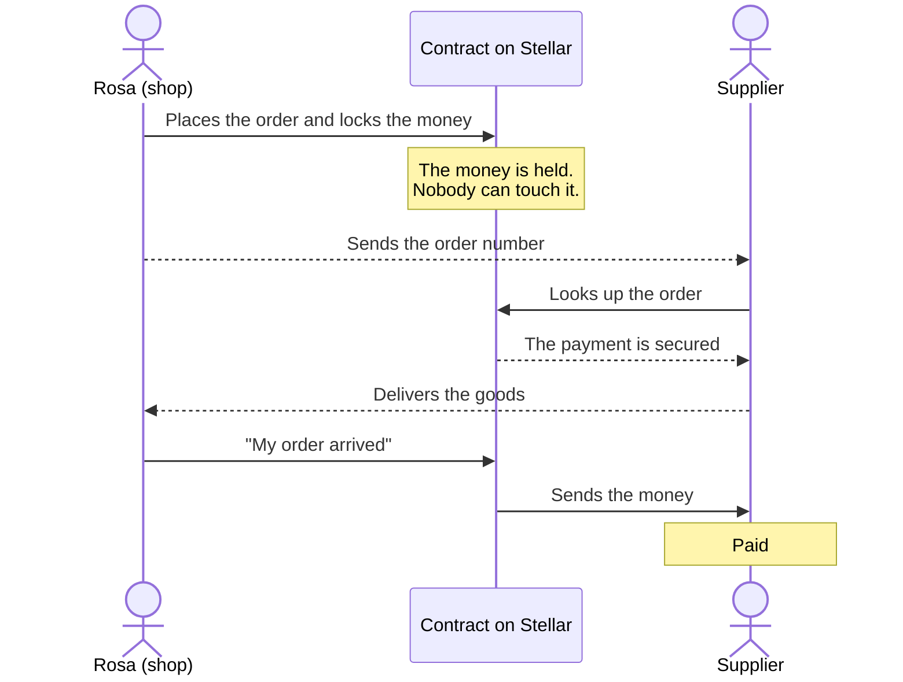

# 🤝 Minga — payments that don't depend on trust

🌐 **English** · [Español](README.es.md)

> ### *Many hands lift what one alone cannot.*

Minga is an app that lets a small shop buy goods from a supplier without either of
them having to take the risk first.

The money is **held and locked** until the goods arrive. Then it is released
automatically. If the order never arrives, the money goes back to whoever put it in.

Under the hood it runs on a contract on the **Stellar** network, but the person using
the app never deals with that. They only read *"Order created"* and *"Payment released"*.

---

## Why it exists

I used to run a bakery, and I ended up closing it.

I don't write code. I build Minga with artificial intelligence tools, by asking and
testing, because I don't want to wait for someone with more degrees to decide this
problem is worth solving.

What drives me isn't a business idea. It's that I know first-hand what it means to put
all your money into a small shop. Every decision in this project is made with that
person in mind: the one with no bank behind them, no lawyer, the one who loses a
week's income when an order goes missing.

That's why the project has two non-negotiable rules:

1. **It has to be understood.** Everything, from the app to this file, is written in
   plain language. If you need to know what a blockchain is to use it, it's badly made.
2. **Anyone can use it.** Universal design: the app has to work no matter how each
   person sees, hears, moves or reads.

---

## The problem, with a name and a face

Rosa runs a neighborhood grocery store. Whenever she needs stock, she runs into the
same problem:

- If she **pays upfront**, she risks the order never arriving, or arriving damaged.
- If she **pays later**, many suppliers don't trust her and won't sell to her.

One of them has to take the risk first. Since neither wants to, the purchase often
doesn't happen at all.

Big companies solved this years ago: they have banks, contracts and lawyers that
guarantee payment between two parties who don't know each other. A neighborhood
grocery store has none of that.

**Minga gives Rosa that same tool.**

---

## How it works

What sits in the middle is called **escrow**: a deposit held as a guarantee. The money
is there, but nobody can touch it yet.

1. **Rosa places the order** and chooses how many days she'll take to check the goods
   when they arrive (from 1 to 60; usually 3). She signs, and the money leaves her
   wallet and is locked in the contract. **Neither Rosa nor the supplier has it.**
2. **The supplier looks up the order number** and sees that the payment is guaranteed.
   They deliver with confidence.
3. **Rosa confirms she received it** and the contract sends the money to the supplier.
4. **If the order doesn't go through**, Rosa cancels and gets everything back.

The journey when everything goes well, step by step:



### And if something goes wrong

This part took the most work, because it's where we find out whether the supplier can
trust the system too.

The first version had a hole: confirming depended only on Rosa. If the supplier
delivered and Rosa never confirmed —because she forgot, lost her phone, or acted in
bad faith— the money stayed stuck forever and the supplier had no way out.

Now **the supplier can declare "I delivered"** with their own signature. That starts
the clock on the time limit Rosa chose:

- If Rosa **confirms**, the supplier gets paid.
- If Rosa **says nothing** and the time runs out, the supplier gets paid anyway.
  Silence no longer hurts them.
- If Rosa **objects** within the time limit ("this never arrived, or it arrived
  damaged"), the money is **frozen**. Nobody gets paid until one of the two sides gives
  in: either Rosa releases the payment, or the supplier returns the money.

All the possible paths:

```mermaid
stateDiagram-v2
    accTitle: All the possible paths of an order
    accDescr: An order starts as pending. From there, Rosa can confirm and the supplier gets paid, or cancel and get her money back. If the supplier declares they delivered, the order becomes delivered and Rosa's time limit starts. From delivered, the supplier gets paid if Rosa confirms or if the time runs out; the order is cancelled if the supplier backs out; and it goes into dispute if Rosa objects within the time limit. In dispute, the money is frozen until Rosa releases the payment or the supplier returns the money.
    state "Pending<br/>money held in the contract" as Pendiente
    state "Delivered<br/>Rosa's time limit starts" as Entregado
    state "In dispute<br/>money frozen, nobody gets paid" as Disputa
    state "Released<br/>the supplier gets paid" as Liberado
    state "Cancelled<br/>the money goes back to Rosa" as Cancelado

    [*] --> Pendiente: Rosa creates the order and picks the time limit
    Pendiente --> Liberado: Rosa confirms
    Pendiente --> Cancelado: Rosa cancels
    Pendiente --> Entregado: the supplier signs "I delivered"
    Entregado --> Liberado: Rosa confirms
    Entregado --> Liberado: the time runs out and the supplier claims
    Entregado --> Cancelado: the supplier backs out
    Entregado --> Disputa: Rosa objects within the time limit
    Disputa --> Liberado: Rosa gives in and releases
    Disputa --> Cancelado: the supplier gives in and returns the money
    Liberado --> [*]
    Cancelado --> [*]
```



**What this prototype doesn't solve yet:** a dispute where neither side gives in. That
needs an arbitrator, and it's out of scope for now. We say it here and not in a
footnote, because hiding it would be selling something it isn't.

---

## A flaw we found and fixed

It's worth telling, because it's the kind of thing that decides whether this product is
useful or dangerous.

**The problem.** The contract is public: anyone can call it without going through the
app. Before, when creating an order, you told it which currency the payment would be
in. Someone could create an order with a **fake currency** —one that says "transferred"
but is worth nothing. The supplier would look it up, see "payment locked and
guaranteed", deliver real goods, and get paid in something worthless.

That broke Minga's promise exactly.

**The fix.** Now the currency is set **only once**, when the contract is installed on
the network, and there is no function that changes it. There's nowhere left to slip in
a fake currency. Anyone can ask the contract which currency it accepts (`get_token`)
before trusting it.

The full review is in [`docs/revision-seguridad.md`](docs/revision-seguridad.md) (in
Spanish). **It is not an audit** and we don't present it as one: an audit is done by
outside people who get paid to break your code. This is an internal review, done
against the official vulnerability checklist that Stellar publishes.

---

## Where it stands today

| | What's there |
|---|---|
| **The contract on the network (testnet)** | The new version, installed on **09/22/2026**: [`CDUJYPSQ…WLMAZ73G`](https://stellar.expert/explorer/testnet/contract/CDUJYPSQOFAQOHNQLERLEG54USCED3MJIGNHLWTILAKUZ22PWLMAZ73G) |
| **The live app** | [minga-r5ql.vercel.app](https://minga-r5ql.vercel.app) |
| **The tests** | **29 automated tests, all passing** |

The contract on the network is the same one in the code: time limit, delivery declared
by the supplier, dispute, on-chain events, and the currency fixed at deploy time.

The evidence, with a link to each transaction and proof that the currency was fixed
correctly, is in [`DESPLIEGUE-TESTNET.md`](DESPLIEGUE-TESTNET.md) (in Spanish). It also
keeps the July deployment, which shows the full flow executed on-chain with money
really moving between wallets.

---

## What we built this week

September 2026, during the **Argentina Builder Challenge**:

- **We closed the fake-currency flaw** (the one described above).
- **Time limit and dispute**, so the supplier isn't held hostage by Rosa's silence.
- **Public events on the network.** Every change of state leaves an event anyone can
  read. It does two things: the app can show order history by reading the network
  instead of relying on the phone's memory, and both Rosa and the supplier can prove
  what they did without depending on the other's word.
- **Orders don't get archived.** On Stellar, stored data expires. Now each order
  renews its expiry date while it's in use, so no one's order "disappears".
- **The app updated for the new contract**: wallet on the supplier screen, time-limit
  field, a button to freeze the payment, a countdown, and a network check every minute.
- **Accessibility**: payment notices are read aloud for screen readers, visible focus
  when navigating by keyboard, fixed contrast, larger text, and a number keypad on
  phones.
- **A full written security review** of the contract.
- **Property tests**: besides testing cases one by one, the computer makes up
  thousands of random combinations and checks that the numbers always add up. We tested
  them by breaking the contract on purpose, to make sure they catch it.
- **A clickable prototype** of the shop's three screens, in
  [`mockups/minga-app.html`](mockups/minga-app.html): it opens with a double click,
  nothing to install.
- **Currency decision: USDC.** While looking into how Rosa would cash out, we found
  MoneyGram Ramps: it lets people withdraw cash at a counter **without a bank
  account**, in more than 170 countries, and it works with USDC on Stellar. For someone
  shut out of the financial system, that's not a technical detail: it's the difference
  between the money being useful or not.

---

## Universal design: why the app is built this way

Accessibility isn't an add-on at the end. It's documented in
[`docs/diseno-accesible.md`](docs/diseno-accesible.md) (in Spanish), and it rests on
three frameworks:

- **Jakob Nielsen's 10 usability heuristics**, so it's easy to understand.
- **The Convention on the Rights of Persons with Disabilities** (articles 2, 9 and 21)
  and universal design, so it's understood no matter how each person sees, hears, moves
  or reads.
- **WCAG 2.1 level AA** as the concrete technical reference.

Some decisions that come from that:

- **Color never carries information alone.** Each state has its own icon, word and
  pattern, so it also works in black and white or with color blindness.
- **Messages say what happened and what to do**, not an error code.
- **No crypto words appear on screen.** You won't read "escrow", "wallet" or
  "transaction".

> The app itself is in Spanish, because it's built for shops in Argentina. The words
> quoted in this file are translated.

---

## How it's built

```
minga/
├── contracts/escrow/        # The contract (Rust, Soroban)
│   ├── src/lib.rs           #   the logic: create, deliver, confirm, object, claim
│   ├── src/test.rs          #   tests for the full flow
│   └── src/propiedades.rs   #   the random (property) tests
├── frontend/                # The app (React + TypeScript)
│   ├── src/wallet.ts        #   wallet connection (Stellar Wallets Kit)
│   ├── src/stellar.ts       #   the layer that talks to the network
│   ├── src/escrow.ts        #   the contract functions, typed
│   └── src/screens/         #   the Shop and Supplier screens
├── mockups/minga-app.html   # Clickable prototype, opens with a double click
├── marca/                   # The logo, in several sizes and formats
├── docs/                    # Security review, accessible design, integrations
├── entrevistas/             # Interview guides by business type + consent form
└── COMANDOS.md              # The exact commands, ready to copy and paste
```

### What the contract does

**Functions that move money** (you have to sign with your wallet):

| Function | Who signs | When it's allowed |
|---|---|---|
| `create_escrow(comprador, proveedor, monto, id_pedido, plazo_dias)` | the shop | always |
| `marcar_entregado(id_pedido)` | **the supplier** | only while Pending |
| `confirm_delivery(id_pedido)` | the shop | Pending, Delivered or In dispute |
| `cancel_escrow(id_pedido)` | the shop | **only while Pending** |
| `objetar_entrega(id_pedido)` | the shop | only Delivered and **within** the time limit |
| `reclamar_pago(id_pedido)` | **the supplier** | only Delivered and **after** the time limit |
| `devolver_fondos(id_pedido)` | **the supplier** | Delivered or In dispute |

The parameters are in Spanish: `comprador` is the buyer, `proveedor` the supplier,
`monto` the amount, `id_pedido` the order number and `plazo_dias` the time limit in
days.

**Read-only functions** (free, no signature): `get_escrow_status`, `get_escrow`,
`get_token`, `segundos_restantes` (seconds left), `puede_reclamar` (can claim).

The currency is set when the contract is installed (`__constructor`) and can never be
changed.

### Where it really touches the network

Look for the `*** ON-CHAIN ***` comments in
[`contracts/escrow/src/lib.rs`](contracts/escrow/src/lib.rs): that's where money
really moves between the shop's wallet, the contract and the supplier.

In [`frontend/src/stellar.ts`](frontend/src/stellar.ts), the comment
`*** ESTO ES ON-CHAIN REAL ***` ("this is real on-chain") marks the exact point where
the operation is signed and sent to the network.

To connect the wallet we use **Stellar Wallets Kit**, which supports several wallets
(Freighter, xBull, Albedo, LOBSTR) through a single connection. We chose it so nobody
is tied to a single wallet.

---

## Try it

**The fastest way, nothing to install:** open
[`mockups/minga-app.html`](mockups/minga-app.html) with a double click, or go to
[minga-r5ql.vercel.app](https://minga-r5ql.vercel.app), open the *Supplier* tab
(«Soy proveedor») and look up one of these demo orders on the new contract:

| Order | What it shows | Status |
|---|---|---|
| **129183** | The money just locked, waiting for the goods. Left untouched on purpose. | Pending |
| **125388** | The full journey: order created, delivered, confirmed and paid. | Payment released |

**Run the tests** (they check that the contract does what it says):

```bash
cd contracts/escrow
cargo test        # all 29 must pass
```

**Run the app:**

```bash
cd frontend
npm install
npm run dev       # opens http://localhost:5173
```

The full commands to install the contract on the network are in
[`COMANDOS.md`](COMANDOS.md) (in Spanish).

Everything runs on **Stellar Testnet**, the test network: **no real money is used.**

---

## Roadmap

Here is **everything Minga promises and doesn't do yet**. It's kept apart from what
already works on purpose: none of this is built, and we don't want it read as if it
were.

The order isn't arbitrary. Each stage needs the previous one to exist.

### Right now

| | What |
|---|---|
| ✅ | ~~Install the new contract on the network.~~ Done on 09/22/2026. |
| ✅ | ~~Leave demo orders on the new contract.~~ Done: orders 129183 and 125388 (see "Try it"). |
| 🔜 | **Order history read from the network**, using the events the contract already publishes. |

### Stage 1 — Recording things should cost nothing

**Record without typing.** The shop owner takes a photo of the supplier's receipt, or
says it out loud. The app shows what it understood and **the person confirms or
corrects it** — it never decides alone.

It works with informal receipts: a handwritten note that says *"sugar 10 kg"*, with no
address or phone number, works just as well. That's what most small suppliers
actually hand over.

**Stock control and alerts.** With what gets recorded, the app knows what's running
low and warns before it runs out.

**Order through WhatsApp.** A link that opens the supplier's WhatsApp with the order
already written. The shop owner just taps "send". The supplier doesn't need to have
Minga, or even know it exists.

### Stage 2 — La Feria: the price library

Every recorded receipt logs **which product, at what price, from which supplier and
on what date**. That builds a shared, anonymous price record that every shop can
look up.

Rosa has her grocery store. Marianita has a small shop five blocks away. Bernardo
sells lumber. All three feed the same record and all three use it.

Four core decisions:

**1. The match is by product, not by type of business.**

Knowing the price of sugar is useless to Bernardo. But **packing tape**, **bags** and
**paper** are bought by him and Rosa alike. Generic supplies cut across businesses
that have nothing to do with each other.

If the record were by type of business, each grocer would need other grocers nearby
for it to be any use. Matching by product, **a lumber seller and a grocer already help
each other** without selling anything alike. Some products overlap, others don't — and
that's fine: each shop sees what's relevant to it.

**2. A price always comes with its date.**

In Argentina, prices change every week. A reference price from six months ago is
useless. Knowing what Marianita is paying **this week** is the difference between
repricing on time and selling below cost without noticing.

**3. It doesn't depend on suppliers adopting anything.**

An informal supplier isn't going to download an app. But the shop owner already gets
their receipt, and records it because it helps them: to know how much they're paying
and to avoid running out of stock. **The library builds itself as a side effect** of
something that's already worth doing.

The same goes for keeping the books: no need for a spreadsheet or learning a
management system. You take the photo, and from that comes what you bought, how much
you spent and what you're running out of. **Order is a side effect of something that
takes three seconds.**

**4. Where each thing is stored.**

| What | Where | Why |
|---|---|---|
| **The price library** | In Minga, shared by all shops | It has to be fast and cheap to look up. Storing thousands of prices on the blockchain would be very expensive and slow. |
| **Payment history** | On the Stellar network | This is what later becomes reputation and credit. It has to be permanent and not depend on Minga continuing to exist. |

This is a deliberate decision, not a convenience: each piece of data goes where it
belongs, based on what it's for.

> **A note on how this is told.** This file is read by judges, mentors and developers,
> so it explains where each thing lives. **None of this appears in the app.** The shop
> owner never reads the word "blockchain", and we don't promise she can "take her data
> with her": for someone closing their business, that's worthless. Her history matters
> at one moment only —when she wants to ask for credit— and by then the app shows it to
> her, without explaining where it's stored.

### Stage 3 — Reputation

Every payment completed leaves a public record on the network. Many completed payments
make **a verifiable history** that the shop owner carries with them, and that no
middleman can take away or deny.

That's what they lack today: an informal shop is invisible to the financial system
because it can't prove anything it has done.

### Stage 4 — Credit without a bank

With a payment history and an inventory record, a shop owner can ask for credit by
showing what they've done, not papers they don't have. The inventory itself can work
as collateral.

This is the reason Minga exists. Everything before it builds the foundation for this.

### Decisions made, still to do

- **Move to USDC.** Because of **MoneyGram Ramps**: it lets people withdraw cash at a
  counter **without a bank account**, in more than 170 countries. For someone shut out
  of the financial system, that's the difference between the money being useful or not.
- **Mediators for stuck disputes.** Today, if neither side gives in, the money stays
  frozen and the contract has no way out. The idea is for a third party to be able to
  unlock it. Who that is still has to be decided: appointed people, or a group that
  votes. Either way, the underlying rule doesn't change: **the mediator decides who the
  money goes to, but can never keep it.**
- **Audited building blocks from [OpenZeppelin](https://github.com/OpenZeppelin/stellar-contracts).**
  Two specific things:
  - **Upgradeable contracts** (SEP-0049). Today the contract can't be fixed: if a bug
    shows up, a new one has to be installed, and old orders stay on the previous one.
  - **The security detectors**, which scan the contract for typical flaws. They don't
    change it, they only analyze it.

  > **What we won't use, on purpose:** access control and allowlists. Minga's contract
  > **has no owner or administrator**: nobody, not even whoever wrote it, can touch the
  > money of an order. Adding a privileged role would create exactly what the product
  > promises doesn't exist. And an allowlist would recreate the system that leaves these
  > people out: here anyone can be a supplier without asking anyone for permission.
- **An external security audit**, through the Stellar Community Fund and the Audit
  Bank. The internal review already done
  ([`docs/revision-seguridad.md`](docs/revision-seguridad.md)) is preparation for that,
  not a replacement.
- **Evaluate [Trustless Work](https://www.trustlesswork.com/)**, which offers escrow as
  a service on Stellar. It could save us from maintaining our own contract. It's a
  decision for later, once the product is out in the world.

### How Minga sustains itself

**Decided, to start: a 1% fee per completed sale, charged to the supplier.** Not to
Rosa. She's the person the system excludes today — charging her would repeat the very
problem Minga solves. The supplier pays, because they gain something new: selling with
guaranteed payment to shops that wouldn't buy from them before because they didn't
know them.

**Planned, with Stage 4: microloans.** When the history of completed payments is
enough to offer credit (see "Stage 4 — Credit without a bank" above), that same piece
also funds the platform: a margin on the credit given, or an origination fee if the
credit comes from a financial partner and Minga only provides the history that makes
it possible. It isn't built yet — it depends on Stage 3 (reputation) working first.

**Under evaluation, not decided: putting stranded money to work.** An idea that **only
holds under strict conditions**, and that remains secondary to the fee and the
microloans.

The money waiting inside the contract could earn a return. But there's a line we don't
cross: **the money of an order in progress is never touched.** Rosa has to be able to
get it back the moment she cancels, without depending on anything or anyone. That's
Minga's core promise and it's not traded for a return.

The only money that could be put to work is **money that got stranded**: forgotten
orders, disputes nobody has resolved in months. And only under three conditions:

1. **Guaranteed instant withdrawal.** If the owner shows up, they get paid right away.
   If that can't be guaranteed, it doesn't happen.
2. **A long, explicit waiting period** before anything counts as stranded, announced in
   advance.
3. **The return belongs to whoever put the money in**, not to Minga, unless something
   else is agreed openly.

If any of the three isn't met, the idea is dropped.

**This last part isn't built or decided.** It's written here so the discussion is
public and not a surprise.

**Still to be measured: the cost of anchors and trustlines.** Two technical things that
aren't budgeted yet:

- **Trustlines.** Every account that wants to hold a currency other than native XLM
  (like USDC) needs to open one, and that locks **0.5 XLM in reserve** per account for
  as long as it's open. It's a network cost, small but real, and it grows with every
  new shop.
- **Anchors** (like MoneyGram Ramps, mentioned above). They convert between pesos and
  the currency on Stellar, and each one has its own fee table. Usually whoever
  withdraws or deposits pays, not Minga — but that table has to be reviewed before
  choosing one, and that hasn't been done yet.

It fits the same underlying idea: use the pieces that already exist in the Stellar
ecosystem instead of reinventing them, and measure what they cost before depending on
them.

### Why escrow came first

Of all these stages, **escrow is the only one that can't exist without a blockchain**.
Recording receipts, tracking stock or ordering through WhatsApp can be done with
ordinary technology. Guaranteeing a payment between two people who don't know each
other, without a company in the middle holding the money, can't.

That's why it was built first: it's the piece where the network is truly needed, and
the one that holds up all the others.

---

The detailed status and day-to-day to-dos are in
[`ESTADO-Y-PROXIMOS-PASOS.md`](ESTADO-Y-PROXIMOS-PASOS.md) (in Spanish).

---

## Who we are

**Cintia Venecia** · **Octavio Giménez Bravo** — Salta, Argentina.

The discovery interviews were done with real entrepreneurs from Salta, in three
different lines of business, to validate that the trust problem with suppliers is real
and not an assumption of ours. The guides and the consent form are in
[`entrevistas/`](entrevistas/) (in Spanish).

The project was born at the **Stellar Pulso Hackathon** (July 2026) and keeps growing
in the **Argentina Builder Challenge** (September 2026).

## Links

- Repository: https://github.com/veneciaedith/minga
- Live app: https://minga-r5ql.vercel.app
- Demo video: https://youtu.be/6X-0l_hIbqs
- The contract on the explorer: [stellar.expert](https://stellar.expert/explorer/testnet/contract/CDUJYPSQOFAQOHNQLERLEG54USCED3MJIGNHLWTILAKUZ22PWLMAZ73G)
